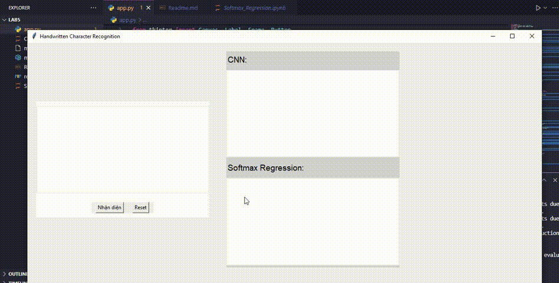

# Simple Optical Character Recognition (OCR)
## Mô tả dự án
Project này thực hiện xây dựng một hệ thống nhận diện chữ viết tay sử dụng các kỹ thuật xử lý ảnh và học máy. Đây là một bài toán quan trọng trong lĩnh vực Thị giác máy tính, có thể ứng dụng trong nhiều lĩnh vực như nhập liệu tự động, nhận diện tài liệu,... Bạn cần phải sử dụng các kỹ thuật xử lý ảnh để phát hiện vị trí, và sử dụng các mô hình học máy để nhận diện các ký tự viết tay, đồng thời triển khai hệ thống với giao diện người dùng cơ bản.
## Cài đặt
### Requirements
1. Tải môi trường [Python 3.10+](https://www.python.org/downloads/).
2. Tải các thư viện cần cho dự án
```
opencv-python
numpy
tk
Pillow
tensorflow
pywin32
```
### Clone the Repository
### Hướng dẫn sử dụng
1. Tải các thư viện cần thiết cho dự án bằng lệnh:
```bash
pip install -r requirements.txt
```
2. Chạy chương trình bằng lệnh:
```bash
python app.py
```
3. Sử dụng ứng dụng

## Cấu trúc dự án
```
vehicle-detection/
├── app.py                          # File chạy ứng dụng
├── mnist_cnn_model.h5              # File trọng số mô hình cnn               
├── mnist_softmax_model.npy         # File trong số mô hình hồi quy softmax                      
├── README.md                       # Tài liệu dự án
├── mini_project2.pdf               # Minh hoạ project
├── CNN.ipynb                       # File xây dựng mô hình CNN
├── Softmax_Regression.ipynb        # File xây dựng mô hình hồi quy Softmax
└── requirements.txt                # Thư viện cần dùng
```

## Tính năng chính
1. **Nhận diện Ký tự viết tay**: Nhận diện từng ký tự viết tay đơn lẻ từ ảnh, sử dụng các mô hình học máy.
2. **So sánh hiệu năng các mô hình**: Áp dụng và so sánh hiệu quả của hai mô hình học máy - một mô hình học máy cơ bản từ đầu (from scratch) và một mô hình Deep Learning.
3. **Giao diện người dùng**: Giao diện đơn giản, cho phép người dùng có thể vẽ trực tiếp lên vùng được chỉ định.
## Huấn luyện mô hình
Tập dữ liệu huấn luyện: MNIST   
Đối với mô hình CNN:    
- Kiến trúc mô hình có thể tham khảo trong file `CNN.ipynb`
- Epochs = 30, validation_split = 0.2.

Đối với mô hình hồi quy Softmax:
- Cách xây dựng mô hình có thể tham khảo trong file `Softmax_Regression.ipynb`
- Learning_rate = 0.1, Epochs =2000

Bạn có thể vào hai file mô hình để có thể điều chỉnh các thông số nếu cần và huấn luyện lại mô hình để lấy được file trọng số của mỗi mô hình

## Kết quả:
Cả hai mô hình đều cho kết quả chưa được tốt. Đối với mô hình hồi quy Softmax cho kết quả dự đoán thấp, còn với mô hình CNN cho kết quả tốt hơn. Nguyên nhân có thể do dữ liệu thực tế do bản thân vẽ tay có thể có kích thước lớn, khi đưa về kích thước (28,28) đối với mô hình CNN hoặc làm phẳng đối với mô hình hồi quy Softmax khiến cho hình ảnh mang vào dự đoán bị mất đi hình dạng giống như trong tập dữ liệu huấn luyện MNIST, từ đó mất đi các đặc trưng và gây ra dự đoán sai.
## Hướng phát triển
- Sử dụng các phương pháp tăng cường dữ liệu để làm đa dạng dữ liệu huấn luyện.
- Phát triển thêm mô hình CNN và hồi quy softmax để nâng cao hơn độ chính xác của mô hình.
- Nghiên cứu và áp dụng các phương pháp xử lý ảnh để ảnh khi mang đi dự đoán có thể hiện đầy đủ đặc trưngm, giúp nâng cao độ chính xác khi dự đoán.

